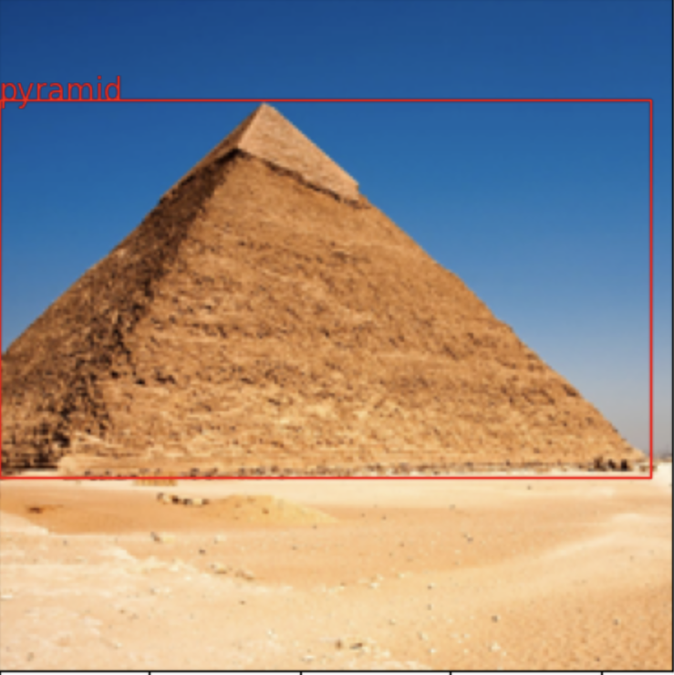

# PALLIGEMA

## Overview
PaliGemma is an open Vision-Language Model (VLM) that is based on the SigLIP-So400m vision encoder and the Gemma-2B language model. It is trained to be a versatile and broadly knowledgeable base model that is effective to transfer. It achieves strong performance on a wide variety of open-world tasks. We evaluate PaliGemma on almost 40 diverse tasks including standard VLM benchmarks, but also more specialized tasks such as remote-sensing and segmentation.
## Features

- **Image Processing**: Resize, normalize, and rescale images.
- **Text Tokenization**: Tokenize text inputs and prepend special tokens.
- **Model Inference**: Run inference on the PaliGemma model with text and image inputs.
- **CPU/GPU Support**: Run inference on CPU or GPU.
- **Sampling Options**: Control sampling temperature and top-p value.
- **Output Generation**: Generate text output from the model.
- **Task Evaluation**: Evaluate the model on a variety of tasks.
- **Task-Specific Inputs**: Process task-specific inputs for the model.


# Results
- Examples of the model's output on different tasks are shown below:

Input Image: 


Palligemma Features:
a.Image Captioning
```
Prompt:caption for this image ?
Answer:In this image we can see a pyramid. In the background there is sky.
```

b.Question Answering
```
Prompt:where is this building ?
Answer:Egypt
```

c. Text Generation ( Text Completion)
```
Prompt:the building is 
Answer: a pyramid.
```
d.object detection
```
Prompt: detect the object in the image
Answer:
```


[//]: # (![]&#40;Assets/pyramids.png&#41;)

## Installation

1. Clone the repository:
    ```sh
    git clone https://github.com/A7medM0sta/PALLIGEMA.git
    cd PALLIGEMA
    ```

2. Install the required Python packages:
    ```sh
    pip install -r requirements.txt
    ```
   
3. Download the model weights following these steps:
    
    a. First you should gain access to you profile in kaggle from Google to use the model
    
    b.
    ```python
   # @title Fetch big_vision code and install dependencies.
    import os
    import sys

    # TPUs with
    if "COLAB_TPU_ADDR" in os.environ:
    raise "It seems you are using Colab with remote TPUs which is not supported."

    # Fetch big_vision repository if python doesn't know about it and install
    # dependencies needed for this notebook.
    if not os.path.exists("big_vision_repo"):
    !git clone --quiet --branch=main --depth=1 \
     https://github.com/google-research/big_vision big_vision_repo

    # Append big_vision code to python import path
    if "big_vision_repo" not in sys.path:
    sys.path.append("big_vision_repo")

    # Install missing dependencies. Assume jax~=0.4.25 with GPU available.
    !pip3 install -q "overrides" "ml_collections" "einops~=0.7" "sentencepiece"
    ```
    c.
    ```python
   ### Configure your API key to access Kaggle
    To use PaliGemma, you must provide your Kaggle username and a Kaggle API key.

   1. To generate a Kaggle API key, go to the **Account** tab of your Kaggle user profile and select **Create New Token**. This will trigger the download of a `kaggle.json` file containing your API credentials.
   1. In Colab, select **Secrets** (🔑) in the left pane and add your Kaggle username and Kaggle API key. Store your username under the name `KAGGLE_USERNAME` and your API key under the name `KAGGLE_KEY`.

    To be able to download, you will also need to acknowledge the Terms and Conditions of the PaliGemma on:

   * https://www.kaggle.com/models/google/paligemma/
     ```
    d. 
    ```python
    import os
    from google.colab import userdata

    # Note: `userdata.get` is a Colab API. If you're not using Colab, set the env
    # vars as appropriate or make your credentials available in ~/.kaggle/kaggle.json

    os.environ["KAGGLE_USERNAME"] = userdata.get('KAGGLE_USERNAME')
    os.environ["KAGGLE_KEY"] = userdata.get('KAGGLE_KEY')
    ``` 
   you can change this part as it is suitable for you.
    but in general this the formal method
    
   e. 
    ```python
    # @title Download checkpoint, tokenizer and dataset to local filesystem.
    #
    import os
    import kagglehub

    MODEL_PATH = "./paligemma-3b-pt-224.f16.npz"
    if not os.path.exists(MODEL_PATH):
    print("Downloading the checkpoint from Kaggle, this could take a few minutes....")
    # Note: kaggle archive contains the same checkpoint in multiple formats.
    # Download only the float16 model.
    MODEL_PATH = kagglehub.model_download('google/paligemma/jax/paligemma-3b-pt-224', MODEL_PATH)
    print(f"Model path: {MODEL_PATH}")

    TOKENIZER_PATH = "./paligemma_tokenizer.model"
    if not os.path.exists(TOKENIZER_PATH):
    print("Downloading the model tokenizer...")
    !gsutil cp gs://big_vision/paligemma_tokenizer.model {TOKENIZER_PATH}
    print(f"Tokenizer path: {TOKENIZER_PATH}")

    DATA_DIR="./longcap100"
    if not os.path.exists(DATA_DIR):
    print("Downloading the dataset...")
    !gsutil -m -q cp -n -r gs://longcap100/ .
    print(f"Data path: {DATA_DIR}")   
    ``` 

## Usage

### Running Inference

To run inference using the PaliGemma model, use the provided `launch_inference.sh` script:

```sh
bash Setup/launch_inference.sh
```

### Script Parameters

- `MODEL_PATH`: Path to the model weights.
- `PROMPT`: Text prompt for the model.
- `IMAGE_FILE_PATH`: Path to the input image.
- `MAX_TOKENS_TO_GENERATE`: Maximum number of tokens to generate.
- `TEMPERATURE`: Sampling temperature.
- `TOP_P`: Top-p sampling value.
- `DO_SAMPLE`: Whether to sample or use greedy decoding.
- `ONLY_CPU`: Whether to force the use of CPU only.

### Example

```sh
#!/bin/bash

MODEL_PATH=""
PROMPT=""
IMAGE_FILE_PATH=""
MAX_TOKENS_TO_GENERATE=
TEMPERATURE=
TOP_P=
DO_SAMPLE="boolean"
ONLY_CPU="boolean"

python inference.py \
    --model_path "$MODEL_PATH" \
    --prompt "$PROMPT" \
    --image_file_path "$IMAGE_FILE_PATH" \
    --max_tokens_to_generate $MAX_TOKENS_TO_GENERATE \
    --temperature $TEMPERATURE \
    --top_p $TOP_P \
    --do_sample $DO_SAMPLE \
    --only_cpu $ONLY_CPU
```
#
## Code Structure
```
PALLIGEMMA/
│
├── __pycache__/
│   ├── modeling_gemma.cpython-311.pyc
│   ├── modeling_siglip.cpython-311.pyc
│   ├── processing_paligemma.cpython-311.pyc
│   └── utils.cpython-311.pyc
│
├── Assets/
│   ├── Answer_for_Building.png
│   ├── Pyramid-of-Khafre-Giza-Egypt.jpg
│   ├── pyramids.png
│   ├── shang_test.jpg
│
├── Evaluation.py
│
├── Fine_Tune/
│   ├── fine-tune-paligemma-with-jax.ipynb
│   ├── finetune_paligemma.ipynb
│   ├── kaggle_1.json
│   └── paligemma-quick-start.ipynb
│
├── Gemma_Modeling/
│   ├── modeling_gemma.py
│   ├── modeling_siglip.py
│   ├── processing_paligemma.py
│   ├── README.md
│   └── requirements.txt
│
├── Setup/
│   ├── launch_inference.sh
│   └── utils.py

```
Directory and File Descriptions:
```
•__pycache__/: Contains compiled Python files.
•Assets/: Holds image files used in the project.
•Evaluation.py: A Python script for evaluation tasks.
•Fine_Tune/: Contains Jupyter notebooks and JSON files for fine-tuning the model.
•Gemma_Modeling/: Includes Python scripts for model development, a README, and a requirements file.
•Setup/: Contains setup scripts and utility files for initializing the project.
```

## References
Special for the references and Umar Gmail:
- https://arxiv.org/abs/2407.07726
- https://huggingface.co/docs/transformers/main/en/model_doc/paligemma
- https://github.com/google-research/big_vision/blob/main/big_vision/configs/proj/paligemma/README.md
- https://blog.roboflow.com/how-to-fine-tune-paligemma/
- https://blog.paperspace.com/paligemma-a-lightweight-open-vision-language-model-vlm/